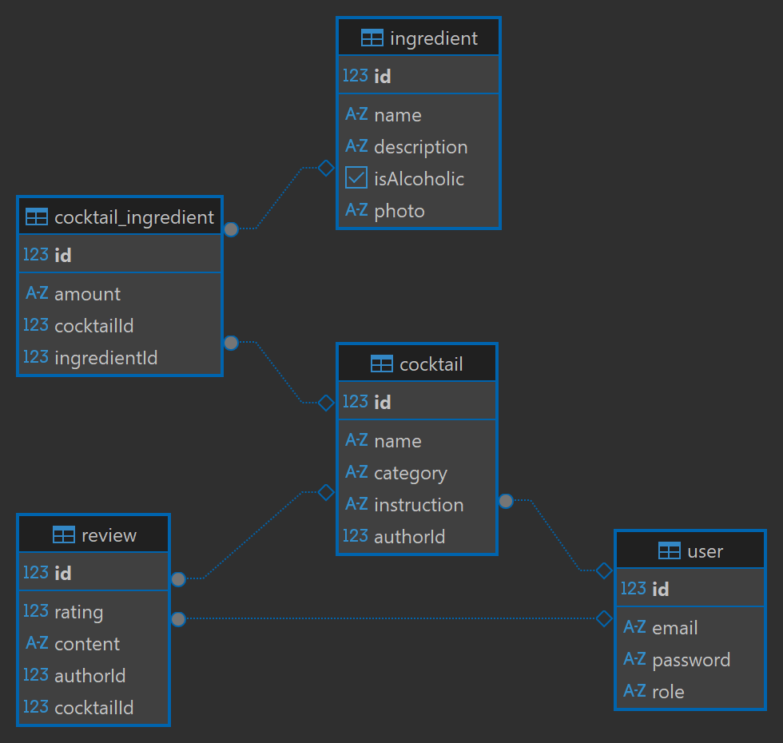

# 🍹 Solvro Cocktailer API

[](https://nestjs.com/)
[](https://www.typescriptlang.org/)
[](https://www.postgresql.org/)
[](https://swagger.io/)
[](https://jwt.io/)
[](https://jestjs.io/)

A comprehensive backend REST API for managing cocktails and their ingredients, developed as a recruitment task for the Solvro science club. 

The application allows for full management of a drinks database, taking into account exact ingredient proportions (modeled using cascading relationships in the database), and provides paginated endpoints with strict input validation. It also includes a full authentication system and role-based access control.

---

## 🛠️ Architecture and Technologies

The project is built on a modern tech stack for the Node.js environment:
- **Framework:** NestJS (TypeScript)
- **Database:** PostgreSQL
- **ORM:** TypeORM
- **Data Validation:** `class-validator` and `class-transformer` (global `ValidationPipe`)
- **Authentication:** Passport.js & JWT (JSON Web Tokens)
- **API Documentation:** Swagger (OpenAPI)
- **Testing:** Jest & Supertest (e2e tests)
- **Containerization:** Docker

---

## 🗄️ Data Model (Domain)

The application is based on five main entities in a relational database:

1. **User** - manages authentication and authorization (email, password hash, role: 'user' or 'admin'). Has a *One-to-Many* relationship with Cocktails (as an author) and Reviews.
2. **Ingredient** - stores basic information about available ingredients (e.g., name, description, alcoholic status, photo).
3. **Cocktail** - the main drink entity, containing the name, category, exact preparation instructions, and a reference to its Author.
4. **CocktailIngredient (Pivot Table / Proportions)** - an entity implementing a *Many-to-Many* relationship with an additional `amount` column. It allows assigning a specific quantity of an ingredient to a specific cocktail (e.g., "50ml of vodka" or "2 slices of lemon").
5. **Review** - allows authenticated users to rate and comment on specific cocktails (rating 1-5, text content). Connected via *Many-to-One* to both User and Cocktail.

---

## 🚀 Running the project locally

### 1. Prerequisites
To run the project on your machine, make sure you have installed:
- **Node.js** (v18+ or newer)
- **NPM** or **Yarn**
- **Docker Desktop** (for a seamless database setup)

### 2. Installation
Clone the repository to your local drive, open the terminal in the main project folder, and run:
```bash
npm install
```

### 3. Database Configuration (Docker)
The application requires a PostgreSQL database. The fastest way to start it is by using Docker. The following command will download the image, create a user, password, and the target `cocktailer_db` database, which the application listens to on port `5432`:
```bash
docker run --name cocktailer-postgres -e POSTGRES_USER=postgres -e POSTGRES_PASSWORD=haslo -e POSTGRES_DB=cocktailer_db -p 5432:5432 -d postgres
```

### 4. Running the API Server
Once the database is up and running, start the NestJS server in development mode (with hot-reload):
```bash
npm run start:dev
```
*Note: Thanks to the `synchronize: true` setting in the TypeORM configuration, the application will automatically create all necessary tables in the database upon the first startup.*

### 5. Running e2e Tests
To verify the application's endpoints (e.g., fetching paginated cocktails), you can run the automated end-to-end tests using Jest and Supertest:
```bash
npm run test:e2e
```

---

## 📖 API Documentation (Swagger)

The application features built-in, interactive Swagger documentation, allowing you to test all endpoints (GET, POST, PATCH, DELETE) directly from your browser, without the need for tools like Postman. It also includes a Bearer Token authorization mechanism for protected routes.

Once the server is running, the documentation is available at:  
👉 **http://localhost:3000/api**

---

## 📊 Database Diagram (ERD)


---
**Author:** Mateusz Reszel  
**License:** MIT